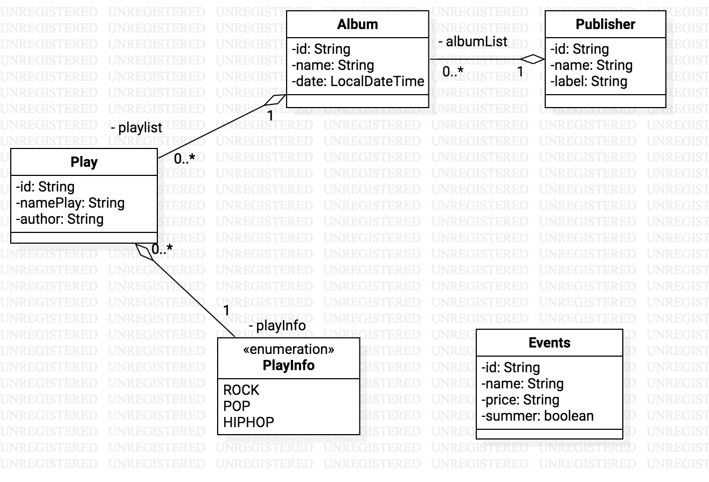

# APAW ECP2 Arquitecturas y Patrones Web
#### Asignatura: *Arquitecturas y Patrones Web*
#### [Máster en Ingeniería Web por la U.P.M.](http://miw.etsisi.upm.es)

### Tecnologías necesarias
* Java
* Maven
* IntelliJ
* GitHub

### Descripción
Este proyecto sobre la realizacion de un API-REST simulado para comprender las capas que intervienen y la organización de los diferentes tipos de test, con integración continua y control de la calidad del código

## Diseño de entidades

# API
### POST /publishers
#### Parámetros del cuerpo
* `name`:String  **required**
* `label`:String 

#### response
* 200 OK  `id:String`
* 403 BAD_REQUEST

### POST /albums
#### Parámetros del cuerpo
*  `name`:String **required**

#### response
* 200 OK id:String
* 403 BAD_REQUEST 

### POST /plays
#### Parámetros del cuerpo
* `namePlay`:String **required**
* `playInfo`:Enum **required**
* `author`: String **required**

#### Response
* 200 OK `id:String`
* 403 BAD_REQUEST

### PUT /publishers/{id}
#### Parámetros del cuerpo
* `name`:String **required**

#### response
* 200 OK
* 403 BAD_REQUEST
* 404 NOT_FOUND

### GET /plays
#### Parámetros del cuerpo
* `namePlay`: String

#### response
* 200: OK  body: id:string, namePlay:String 
* 404: NOT_FOUND

### PATCH /albums/{id}/plays
#### Parámetros del cuerpo
* `namePlayid`:String **required**
* author:String

#### response
* 200 OK 
* 403 NOT_FOUND

### DELETE /plays/{id}
#### Parámetros del cuerpo
* `namePlay`:String **required**

#### response
* 200 OK 
*  404 NOT_FOUND

### GET /plays/search?nameplay={id}
#### response 
* 200 OK  `id:String namePlay:String playinfo: String`
* 403 BAD_REQUEST

